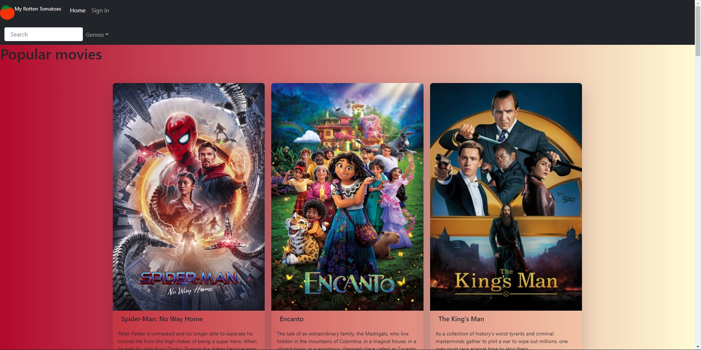
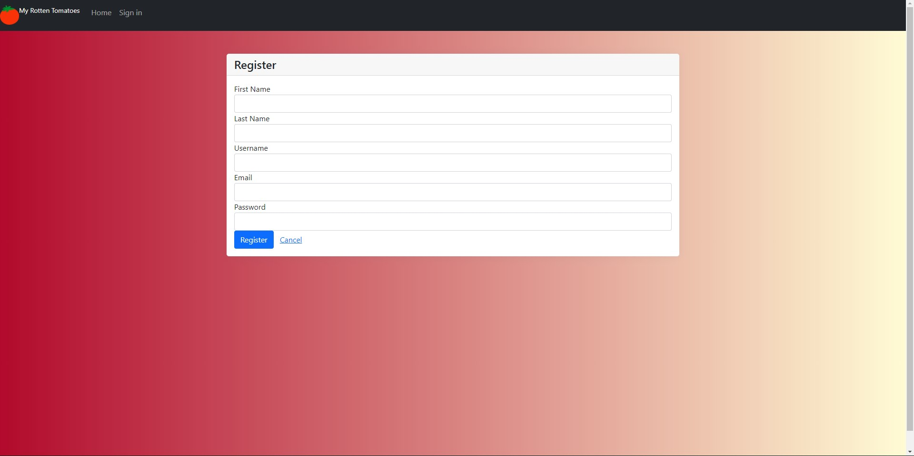
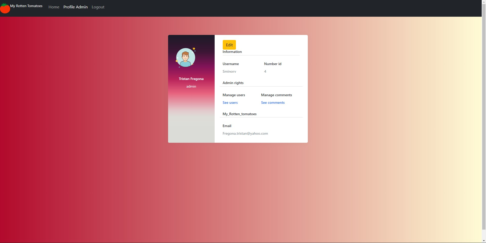
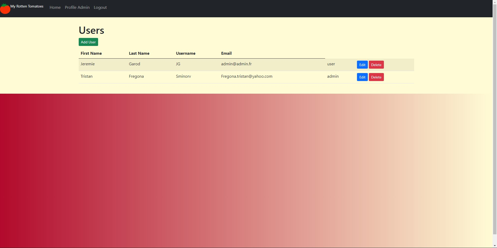
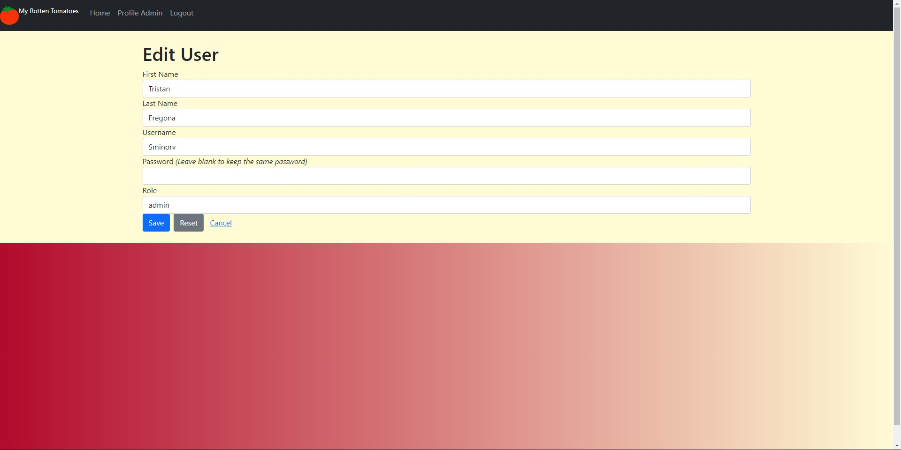
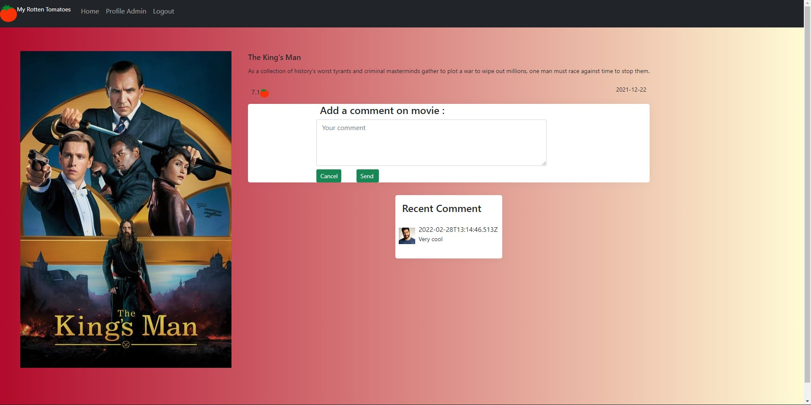

# My_Rotten_Tomatoes

## Project setup

```
npm install
```

### Run the web app

```
npm run dev
```

## Web App Preview

### Home page

Display popular movies of the moment
<br>
Search with a query or by genres

<p align="center">
  
</p>

### Sign up and sign in page

Form for create an account in a json file as data base

<p align="center">
  
</p>

### User profile page

Access to the admin page when the user own this role

<p align="center">
  
</p>

### Admin CRUD

Create, read, update and delete users or comments

<p align="center">
  
</p>

### Update his profile

Form for updating his profile

<p align="center">
  
</p>

### Dynamic page for each movie

Display the last comment
<br>
Possibility to comment when the user is logged

<p align="center">
  
</p>

## Authors

- [DIOP Doudou](https://github.com/Douzdiop)
- [FREGONA Tristan](https://github.com/Tfregona)
- [GAROD Jeremie](https://github.com/JeremieG06)
